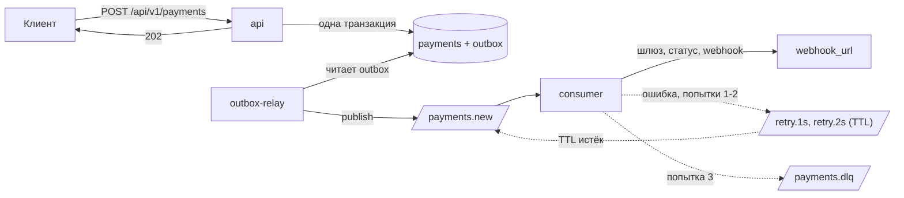

# Payflow

Асинхронный процессинг платежей: API принимает платёж и сразу отвечает 202, consumer
проводит его через шлюз (эмуляция) и шлёт результат на webhook клиента.

FastAPI, SQLAlchemy 2.0 async, PostgreSQL, RabbitMQ (FastStream), Alembic, Docker Compose.

## Запуск

```bash
docker compose --profile demo up --build
```

| | |
|---|---|
| Swagger | http://localhost:8000/docs |
| RabbitMQ | http://localhost:15672 (guest / guest) |
| Приёмник вебхуков | http://localhost:9000/received |

Ключ API `local-dev-api-key`, в Swagger подставлен автоматически.
Порты меняются в `.env` (см. `.env.example`). Другие команды: `make help`.

## Проверка

```bash
bash scripts/demo.sh
```

Скрипт создаёт платёж и дожидается webhook, потом создаёт платёж с получателем,
который всегда отвечает 500, и дожидается трёх попыток и сообщения в DLQ. Нужен `jq`.

Или руками. Создать платёж:

```bash
curl -X POST http://localhost:8000/api/v1/payments \
     -H "X-API-Key: local-dev-api-key" \
     -H "Idempotency-Key: order-1042" \
     -H "Content-Type: application/json" \
     -d '{
           "amount": "1500.00",
           "currency": "RUB",
           "description": "Заказ #1042",
           "metadata": {"order_id": 1042},
           "webhook_url": "http://webhook-sink:9000/webhook"
         }'
```

Через 2-5 секунд посмотреть результат (`payment_id` из ответа):

```bash
curl http://localhost:8000/api/v1/payments/$PAYMENT_ID -H "X-API-Key: local-dev-api-key"
```

Что получил клиент:

```bash
curl http://localhost:9000/received
```

Чтобы увидеть retry и DLQ, в `webhook_url` укажите `http://webhook-sink:9000/fail`.

## Как устроено



- **api** принимает платёж. Платёж и событие пишутся в одной транзакции (outbox),
  к брокеру api не ходит.
- **outbox-relay** берёт неопубликованные события (`FOR UPDATE SKIP LOCKED`), публикует
  с подтверждением брокера и ставит `published_at`.
- **consumer** обрабатывает по стадиям, глядя на состояние в базе: повтор сообщения
  не проводит платёж второй раз и не шлёт webhook дважды.

Retry: три попытки с задержками 1 и 2 секунды через очереди с TTL, после третьей
сообщение уходит в `payments.dlq` с заголовками `x-attempt` и `x-last-error`.
Отказ шлюза (те самые 10%) не ошибка: платёж становится `failed`, webhook уходит,
повторов нет. Ретраятся только сбои: шлюз не ответил, база недоступна, webhook не доставлен.

Идемпотентность: `Idempotency-Key` в уникальной колонке, вставка через
`INSERT ... ON CONFLICT DO NOTHING`. Повтор с тем же телом возвращает тот же платёж
и `Idempotent-Replayed: true`, с другим телом 409.

## API

Все эндпоинты требуют заголовок `X-API-Key`.

| | |
|---|---|
| `POST /api/v1/payments` | создать платёж, заголовок `Idempotency-Key` обязателен, ответ 202 |
| `GET /api/v1/payments/{id}` | состояние платежа: `status`, `processed_at`, `webhook_delivered_at`, `failure_reason` |
| `GET /health` | 200 если база отвечает |

Тело POST: `amount` (decimal > 0, до 2 знаков), `currency` (RUB/USD/EUR), `description`,
`metadata` (объект), `webhook_url`.

Ошибки в едином формате `{"error": {"code": "...", "message": "..."}}`: `unauthorized` 401,
`idempotency_key_missing` / `idempotency_key_invalid` 400, `idempotency_conflict` 409,
`validation_failed` 422 (поля в `fields`), `payment_not_found` 404. Подробнее в Swagger.

Webhook: `POST` на `webhook_url` с телом платежа, заголовки `X-Payment-Id` и `X-Attempt`.
Доставлено = любой 2xx.

## Настройки

Переменные окружения, у всех есть дефолты.

| | По умолчанию |
|---|---|
| `DATABASE_URL`, `RABBITMQ_URL` | localhost |
| `API_KEY` | `local-dev-api-key` |
| `DOCS_PREAUTHORIZE_API_KEY` | `false` (в compose `true`) |
| `GATEWAY_DELAY_MIN_SECONDS` / `GATEWAY_DELAY_MAX_SECONDS` | 2 / 5 |
| `GATEWAY_SUCCESS_RATE` | 0.9 |
| `CONSUMER_MAX_ATTEMPTS` / `RETRY_BASE_DELAY_SECONDS` | 3 / 1 |
| `WEBHOOK_TIMEOUT_SECONDS` | 5 |

С `ENV=production` приложение с дефолтным ключом не стартует.

## Тесты

```bash
pip install -r requirements-dev.txt
docker compose up -d postgres
pytest
ruff check . && alembic check
```

71 тест на настоящем Postgres, брокер в памяти (`TestRabbitBroker`). Цепочка
retry → TTL → DLQ на настоящем RabbitMQ проверяется скриптом `scripts/demo.sh`,
в CI это отдельный job.

## За рамками

Подпись webhook, защита `webhook_url` от внутренних адресов, чистка таблицы `outbox`,
метрики.
