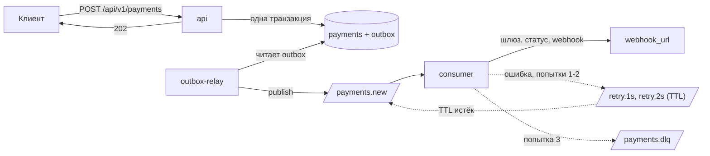

# Payflow

Асинхронный процессинг платежей: API принимает платёж и сразу отвечает 202, consumer
проводит его через шлюз (эмуляция) и шлёт результат на webhook клиента.

FastAPI, SQLAlchemy 2.0 async, PostgreSQL, RabbitMQ (FastStream), Alembic, Docker Compose.

## Запуск

```bash
docker compose --profile demo up --build
```

| | |
|---|---|
| Swagger | http://localhost:8000/docs |
| RabbitMQ | http://localhost:15672 (guest / guest) |
| Приёмник вебхуков | http://localhost:9000/received |

Ключ API `local-dev-api-key`, в Swagger подставлен автоматически.
Порты меняются в `.env` (см. `.env.example`). Другие команды: `make help`.

## Проверка

```bash
bash scripts/demo.sh
```

Скрипт создаёт платёж и дожидается webhook, потом создаёт платёж с получателем,
который всегда отвечает 500, и дожидается трёх попыток и сообщения в DLQ. Нужен `jq`.

Или руками. Создать платёж:

```bash
curl -X POST http://localhost:8000/api/v1/payments \
     -H "X-API-Key: local-dev-api-key" \
     -H "Idempotency-Key: order-1042" \
     -H "Content-Type: application/json" \
     -d '{
           "amount": "1500.00",
           "currency": "RUB",
           "description": "Заказ #1042",
           "metadata": {"order_id": 1042},
           "webhook_url": "http://webhook-sink:9000/webhook"
         }'
```

Через 2-5 секунд посмотреть результат (`payment_id` из ответа):

```bash
curl http://localhost:8000/api/v1/payments/$PAYMENT_ID -H "X-API-Key: local-dev-api-key"
```

Что получил клиент:

```bash
curl http://localhost:9000/received
```

Чтобы увидеть retry и DLQ, в `webhook_url` укажите `http://webhook-sink:9000/fail`.

## Как устроено



**api** принимает платёж. Платёж и событие для брокера пишутся в одной транзакции
(outbox), сам api к RabbitMQ не ходит.

**outbox-relay** забирает неопубликованные события из таблицы outbox, публикует их
в RabbitMQ с подтверждением и помечает как опубликованные.

**consumer** обрабатывает платёж по стадиям и смотрит на состояние в базе, поэтому
повтор сообщения не проводит платёж второй раз и не шлёт webhook дважды.

**Retry и DLQ.** Три попытки с задержками 1 и 2 секунды через очереди с TTL. После
третьей сообщение уходит в `payments.dlq` с причиной в заголовке `x-last-error`.
Отказ шлюза (те самые 10%) не считается ошибкой: платёж становится `failed`, клиент
получает webhook, повторов нет. Повторяются только сбои: шлюз не ответил, база
недоступна, webhook не доставлен. Когда причина устранена, `make dlq-replay` возвращает
сообщения из DLQ в обработку.

**Идемпотентность.** `Idempotency-Key` хранится в уникальной колонке. Повтор запроса
с тем же телом возвращает тот же платёж и заголовок `Idempotent-Replayed: true`,
с другим телом отвечает 409.

## API

Все эндпоинты требуют заголовок `X-API-Key`. Полное описание с примерами есть в Swagger.

| Метод | Путь | Что делает |
|---|---|---|
| POST | `/api/v1/payments` | Создать платёж. Нужен заголовок `Idempotency-Key`. Ответ 202 |
| GET | `/api/v1/payments/{id}` | Состояние платежа |
| GET | `/health` | 200, если база отвечает |

Тело POST:

| Поле | Тип | Правила |
|---|---|---|
| `amount` | decimal | больше 0, не более двух знаков после запятой |
| `currency` | string | RUB, USD или EUR |
| `description` | string | необязательно |
| `metadata` | object | необязательно, любой JSON |
| `webhook_url` | string | http или https, не localhost и не внутренний IP |

В ответе GET помимо этих полей приходят `status` (pending / succeeded / failed),
`processed_at`, `webhook_delivered_at` и `failure_reason`.

Ошибки всегда в одном формате:

```json
{"error": {"code": "idempotency_conflict", "message": "..."}}
```

| Код | HTTP | Когда |
|---|---|---|
| `unauthorized` | 401 | нет или неверный ключ |
| `idempotency_key_missing` | 400 | нет заголовка `Idempotency-Key` |
| `idempotency_key_invalid` | 400 | ключ не по формату |
| `idempotency_conflict` | 409 | тот же ключ с другим телом |
| `validation_failed` | 422 | тело не прошло проверку, поля перечислены в `fields` |
| `payment_not_found` | 404 | нет такого платежа |
| `not_found` | 404 | нет такого пути |
| `body_too_large` | 413 | тело больше 256 КБ |
| `internal_error` | 500 | непредвиденный сбой, `X-Request-Id` в заголовке ответа |

Webhook: POST на `webhook_url` с телом платежа. В заголовках `X-Payment-Id` и `X-Attempt`.
Любой ответ 2xx считается доставкой, всё остальное уходит в retry.

## Настройки

Переменные окружения, у всех есть значения по умолчанию.

| Переменная | По умолчанию | Что |
|---|---|---|
| `DATABASE_URL` | localhost:5432 | строка подключения к Postgres |
| `RABBITMQ_URL` | localhost:5672 | строка подключения к RabbitMQ |
| `API_KEY` | `local-dev-api-key` | ключ для `X-API-Key` |
| `DOCS_PREAUTHORIZE_API_KEY` | `false` | подставлять ключ в Swagger (в compose включено) |
| `GATEWAY_DELAY_MIN_SECONDS` | 2 | минимальная задержка шлюза |
| `GATEWAY_DELAY_MAX_SECONDS` | 5 | максимальная задержка шлюза |
| `GATEWAY_SUCCESS_RATE` | 0.9 | доля успешных платежей |
| `CONSUMER_MAX_ATTEMPTS` | 3 | попыток обработки до DLQ |
| `RETRY_BASE_DELAY_SECONDS` | 1 | первая задержка, дальше удваивается |
| `WEBHOOK_TIMEOUT_SECONDS` | 5 | таймаут доставки webhook |

С `ENV=production` приложение с ключом по умолчанию не стартует.

## Тесты

```bash
pip install -r requirements-dev.txt
docker compose up -d postgres
make test                # база payments_test создастся сама
make lint
make check-migrations
```

75 тестов на настоящем Postgres, брокер в памяти (`TestRabbitBroker`). Цепочка
retry → TTL → DLQ на настоящем RabbitMQ проверяется скриптом `scripts/demo.sh`,
в CI это отдельный job.

## За рамками

Подпись webhook, проверка `webhook_url` по DNS (сейчас отсекаются только адреса, заданные
IP), чистка таблицы `outbox`, метрики.
